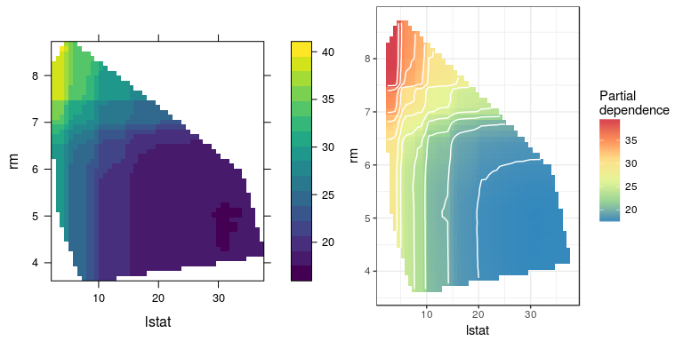
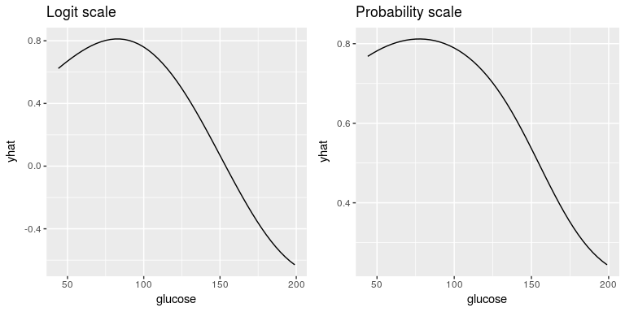

[](https://cran.r-project.org/package=pdp)
[](https://travis-ci.org/bgreenwell/pdp)
[](https://codecov.io/github/bgreenwell/pdp?branch=master)
[](http://cranlogs.r-pkg.org/badges/pdp)
[](http://cranlogs.r-pkg.org/badges/grand-total/pdp)
[](http://www.rdocumentation.org/packages/pdp)

# pdp: An R Package for Constructing Partial Dependence Plots

Complex nonparametric models---like neural networks, random forests, and support vector machines---are more common than ever in predictive analytics, especially when dealing with large observational databases that don't adhere to the strict assumptions imposed by traditional statistical techniques (e.g., multiple linear regression which assumes linearity, homoscedasticity, and normality). Unfortunately, it can be challenging to understand the results of such models and explain them to management. Partial dependence plots offer a simple solution. Partial dependence plots are low-dimensional graphical renderings of the prediction function $\widehat{f}\left(\boldsymbol{x}\right)$ so that the relationship between the outcome and predictors of interest can be more easily understood. These plots are especially useful in explaining the output from black box models. The `pdp` package offers a general framework for constructing partial dependence plots for various types of fitted models in R. 

A detailed introduction to `pdp` has been accepted for publication in The R Journal; a preprint is available [here](https://github.com/bgreenwell/pdp-paper/blob/master/RJwrapper.pdf). You can track development on  at https://github.com/bgreenwell/pdp. To report bugs or issues, contact the main author directly or submit them to https://github.com/bgreenwell/pdp/issues. 

As of right now, `pdp` exports four functions:

* `partial` - compute partial dependence functions (i.e., objects of class `"partial"`) from various fitted model objects;
* `plotPartial"` - plot partial dependence functions (i.e., objects of class `"partial"`) using `lattice` graphics;
* `autoplot` - plot partial dependence functions (i.e., objects of class `"partial"`) using `ggplot2` graphics;
* `topPredictors` extract most "important" predictors from various types of fitted models.

## Installation

The `pdp` package is [currently listed on CRAN](https://CRAN.R-project.org/package=pdp) and can easily be installed:
```r
  # Install from CRAN (recommended)
  install.packages("pdp")
  
  # Alternatively, install the development version from GitHub
  devtools::install_github("bgreenwell/pdp")
```

## Random forest example

As a first example, we'll fit a random forest to the famous Boston housing data included with the package (see `?boston` for details). In fact the original motivation for this package was to be able to compute two-predictor partial dependence plots from random forest models in R. 

```r
# Fit a random forest to the Boston housing data
library(randomForest)  # install.packages("randomForest")
data (boston)  # load the boston housing data
set.seed(101)  # for reproducibility
boston.rf <- randomForest(cmedv ~ ., data = boston)

# Partial dependence of cmedv on lstat and rm
library(pdp)
pd <- partial(boston.rf, pred.var = c("lstat", "rm"), chull = TRUE)
head(pd)  # print first 6 rows
```

```
##     lstat      rm     yhat
## 1  7.5284 3.66538 24.13683
## 2  8.2532 3.66538 23.24916
## 3  8.9780 3.66538 23.13119
## 4  9.7028 3.66538 22.13531
## 5 10.4276 3.66538 20.62331
## 6 11.1524 3.66538 20.51258
```

```r
# Lattice version
p1 <- plotPartial(pd, main = "lattice version")

# ggplot2 version
library(ggplot2)
p2 <- autoplot(pd, contour = TRUE, title = "ggplot2 version", 
               legend.title = "Partial\ndependence")

# Show both plots in one figure
grid.arrange(p1, p2, ncol = 2)
```

<!-- -->

Next, we'll fit a classification model to the Pima Indians Diabetes data.


## Support vector machine (SVM) example

As a second example, we'll fit an SVM to the Pima Indians diabetes data included with the package (see `?pima` for details). Note that for some fitted model objects (e.g., `"ksvm"` objects) it is necessary to supply the original training data via the `train` argument in the call to `partial`.


```r
# Fit an SVM to the Pima Indians diabetes data
library(kernlab)  # install.packages("kernlab")
data (pima)  # load the Pima Indians diabetes data
pima.svm <- ksvm(diabetes ~ ., data = pima, type = "C-svc", kernel = "rbfdot",
                 C = 0.5, prob.model = TRUE)
 
# Partial dependence of diabetes test result on glucose (default is logit scale)
pd.glucose <- partial(pima.svm, pred.var = "glucose", train = pima)

# Partial dependence of diabetes test result on glucose (probability scale)
pd.glucose.prob <- partial(pima.svm, pred.var = "glucose", prob = TRUE, 
                           train = pima)

# Show both plots in one figure
grid.arrange(autoplot(pd.glucose, title = "Logit scale"), 
             autoplot(pd.glucose.prob, title = "Probability scale"), 
             ncol = 2)
```

<!-- -->
